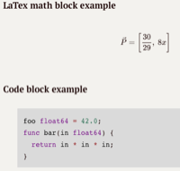
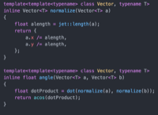

### My Portfolio
As a generalist, my focus is to touch as many aspects of computer programming as possible, as early as possible. Breadth before depth is my main operating mode, and what I enjoy the most. Here is a rough map of what I have covered so far.

[My Code](#MyCode)  
[My Projects](#MyProjects)  
[My Languages](#MyLanguages) 
[My Platforms](#MyPlatforms) 
[My Tools](#MyTools) 
[My Books](#MyBooks) 
[My Courses](#MyCourses) 
[My People](#MyPeople) 

### My Code
This repository has a collection of small projects that are deemed too small to have their own repository. Most projects here are of the experimental/learning-new-stuff kind, and are therefore not to be used directly for serious work.

### My Projects
Summary of extracurricular projects

| Description | Thumbnail | Keywords | Time period |
| ----------- | ----------- | ----------- | ----------- |
|[Kompendium - Mathamatics for Programming](https://github.com/Arxcis/ProgMatteKompendium) ||Documentation, Markdown, Latex| 2017.02 - |
| [JET - Template Library for C++](https://github.com/Arxcis/jetlib)|| Graphics, Math | 2017.01 -|
||||||

### My Languages
Overview of languages I have studied:

|Language|Can read|Can write|Used in project|
|--------|--------|---------|-----------------|
| C    | X | X |   |
| C++  | X | X | X |
| C#   | X | X | X |
| Java | X |  |   |
| Go   | X | X |   |
| Rust | X |   |   |
| Assembly Languages | X |  |  |
| Javascript | X | X | X |
| XML  | X | X |   |
| JSON | X | X |   |
| HTML | X | X | X |
| CSS  | X | X | X |
| PHP  | X | X | X |
| Python   | X | X | X |
| Bash     | X | X |   |
| PowerShell | X | X |  |
| Prolog   | X |   |   |
| Jai      | X |   |   |
| SQL      | X | X | X |
| Markdown | X | X | X |
| LaTex    | X | X |   ||

### My Platforms
Platforms I am able to develop for:
- Windows
- macOS
- Linux
- Web
- iOS
- Android

### My Tools
Tools i am familiar with:
- Git
- Unity 3D
- Sublime, Atom, Notepad++, Vim
- Xcode
- Android Studio
- Visual Studio, Visual Code
- Trello
- Draw.io
- Mischief
- Google Docs
- Photoshop
- Sketchup 3D

### My Books
Books which made me a better developer:

|Title|Author|First read|
|----|----|----|
|Modern Operating Systems|Andrew S. Tanenbaum|2017|
|Game Programming Patterns|Robert Nystrøm|2017|
|C# in depth (3rd) |Jon Skeet|2017|
|User Story Mapping| Jeff Patton | 2017|
|Datastructures + Algorithms = Programs| Niklaus Wirth | 2016|
|The Art of Game Design | Jesse Schell | 2016 |

### My Courses
Current courses at NTNU
- Object Oriented Programming in C++ - 2017
- Mathematics for Programming - 2017
- Systems development - 2017
- Operating Systems - 2017

Finished courses at NTNU
- Elementary Programming in C++ - 2016
- Mathematics for IT - 2016
- Experience Design - 2016
- Data modeling and Database design - 2016

### My People
People who inspires me to love my work
- Chandler Carruth - Performance guru
- Daniel Shiffman - Youtuber
- Simon McCullum  - Teacher
- Bernt Tore Jensen - Teacher
- John Carmack  - Game developer
- Jonathan Blow - Game developer
- Robin Garen   - Teacher
